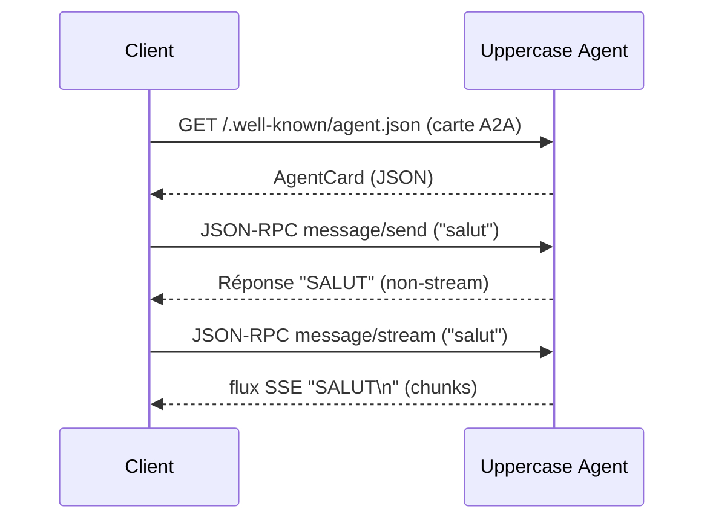

# Fonctionnement des scripts A2A

Ce document décrit comment interagissent les deux scripts Python :

| Script | Rôle | Point d’entrée |
|--------|------|----------------|
| **`a2a_example.py`** | Serveur : expose un agent A2A nommé *Uppercase Agent* qui transforme chaque message utilisateur en **MAJUSCULES**. | `uvicorn a2a_example:app …` |
| **`test_python.py`** | Client : découvre la carte A2A de l’agent, envoie un message une première fois en mode *non‑streaming*, puis refait la même requête en mode *streaming* SSE. | `python3 test_python.py` |

---

## 1. Schéma général



---

## 2. Détails de `a2a_example.py`

### 2.1 UppercaseAgent  
```python
class UppercaseAgent:
    async def transform(self, text: str) -> str:
        await asyncio.sleep(0.1)  # petite latence simulée
        return text.upper()
```
*Se contente de mettre le texte reçu en majuscules.*

### 2.2 UppercaseAgentExecutor  
* Pont entre le protocole A2A et la logique métier.
* Récupère le message utilisateur via `RequestContext` → `params.message`.
* Extrait puis concatène les parties texte (`parts`).
* Appelle `UppercaseAgent.transform`.
* Empile la réponse dans `event_queue` (obligatoirement avec `await`).

### 2.3 AgentCard  
Expose publiquement, à l’URL `http://localhost:9999/.well-known/agent.json`, une **fiche d’identité** décrivant :
* nom, description, version,
* compétences (skill *uppercase*),
* indicateur `capabilities.streaming = true` (support SSE).

### 2.4 Application Starlette  
Le serveur est construit avec :  

```python
app = A2AStarletteApplication(
    agent_card=agent_card,
    http_handler=request_handler,
).build()
```
Il suffit donc de lancer :

```bash
uvicorn a2a_example:app --host 0.0.0.0 --port 9999 --reload
```

---

## 3. Détails de `test_python.py`

| Étape | Explication |
|-------|-------------|
| **1.** `A2ACardResolver.get_agent_card()` | Télécharge la carte JSON pour récupérer l’URL, les capabilities, etc. |
| **2.** Instanciation d’`A2AClient` | Fournit le `agent_card` + le client HTTPX partagé. |
| **3.** **Non‑streaming** (`send_message`) | Envoie un objet `SendMessageRequest` → reçoit un `Message` complet. |
| **4.** **Streaming** (`send_message_streaming`) | Envoie la même requête via `SendStreamingMessageRequest` → itère sur les « chunks » SSE (chaque chunk est un `Message` ou un événement de contrôle). |

### 3.1 Payload minimal

```python
payload = {
    "message": {
        "role": "user",
        "parts": [{"kind": "text", "text": "salut"}],
        "messageId": uuid4().hex
    }
}
```

Le wrapper `MessageSendParams(**payload)` sérialise tout selon le schéma A2A.

---

## 4. Exécution pas‑à‑pas

```bash
# 1) Démarrer l’agent
uvicorn a2a_example:app --host 0.0.0.0 --port 9999 --reload

# 2) Dans un autre terminal, lancer le client
python3 test_python.py
```

Sortie attendue :

```
Réponse non‑streaming : … 'text': 'SALUT' …
Chunk streaming       : … 'text': 'SALUT' …
```

---

## 5. Personnalisation

* **Transformer autre chose que du texte** : ajouter des `input_modes` (ex. `image`) et étendre `transform`.
* **Réponses plus longues / incrémentales** : diviser `transformed` en plusieurs messages et les `await event_queue.enqueue_event(msg)` un par un.
* **Sécurité / Auth** : définir `supports_authenticated_extended_card=True` et protéger l’endpoint via un *middleware* Starlette.

---

## 6. Dépendances minimales

```txt
a2a-python>=0.5
httpx>=0.26
httpx-sse>=0.4
uvicorn[standard]>=0.29
```

Verrouille la version du SDK pour éviter de futures ruptures :

```txt
a2a-python==0.5.3
```

---

_Fin du document._  
